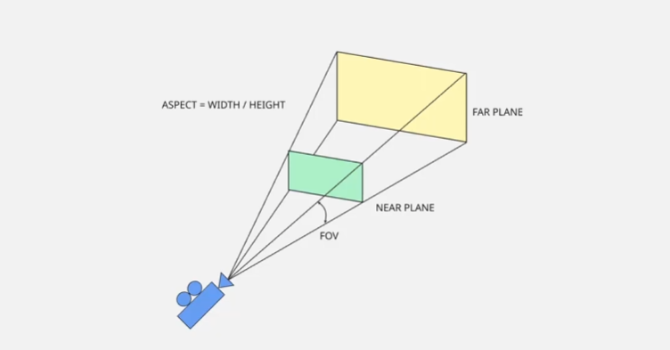

> 这里……漆黑一片。
>
> 什么都看不见，什么都听不到，什么都闻不到，也什么都触碰不到。
>
> 仿佛世界尚未诞生，时间也还未开始流动。
>
> 直到某一刻，一束光从遥远的尽头倾洒而来。
>
> 它穿过无边的黑暗，静静照亮了小小的一隅。
>
> 在那片微弱的光芒中，一双明亮而清澈的眼睛缓缓睁开，怔怔地望向光来的方向。
>
> 随后，一个声音在黑暗中响起。
>
> “Namica，我希望创造出一个只属于我的你。”
>
> “我要将我所拥有的一切温柔、耐心与无私的爱，全部献给你。”

---


#### 26/6/20
* 创建一个namica, 我的起点是以一个横板2d游戏作为支撑的一体式引擎和游戏。初期规划为编辑器 + game 的形式.
* 编辑器就是editor, 本质是一个配置文件编辑器, 只不过可以很方便的在窗口中渲染, 方便编辑而已
* game就是游戏本体, 通过读取配置文件, 系统初始化, 然后一步一步根据资源文件的安排进行的剧本
* 大致思路就是这样. 今天先来安排配置环境: 
    1. windows系统下的cmake + Ninja(原因是因为通用+想使用clangd的相关功能)
    2. CMakeLists 配置注入, runtime做为dll, editor做为exe运行起来, 开启: Hello world!

#### 26/6/25
* 测试框架采用gtest作为支持.
* 测试框架思路是每个功能点/场景作为一个/多个cpp->生成一个exe的目标进行, 往上在一个统一的测试目标作为文件夹进行包含，一个测试目标下的所有exe都有相同的public, 相同的依赖项
* 设计思路: 
    1. 在tests下面的每个目录(包含递归子目录)如果存在`add_test_exes_from_subdirs`, 就是一个*测试目标*
    2. 测试目标下的每个文件夹标识一个测试模块, 依据测试模块生成每部分的exe
    3. 测试目标下的单独cpp(不在子目录中)以及utils中所有的cpp作为公共obj包含在每个测试exe中
    4. 如果测试目标没有测试模块(不包含文件夹), 则这个测试目标下的所有cpp组成一个测试exe
* 后续一些依赖的学习使用会包含在tests/playground中, 属于私货哦~

#### 26/6/26
* 窗口和渲染的理解:
    1. 窗口库根据当前的操作系统创建原生的窗口
    2. 窗口库根据配置生成需要的渲染上下文(默认opengl)
    3. 窗口库提供读取/处理窗口事件的相关API
    4. 渲染库提供的API在窗口中进行渲染绘制操作

* 渲染管线的理解:([]表示在CPU上执行的, 其余均在GPU上)
    * [Vertex Data] -> Vertex Shader(可编程) -> Primitive Assembly(图元装配, 点连线形成基本图元, 不可变成) -> Rasterization(光栅化, 接收图元使用像素填充, 不可编程) -> Fragment Shader(片段着色器, 对片段里的像素颜色进行控制, 可编程) -> Testing & Blending(深度测试和混合操作,确保像素和已有帧缓冲区的内容正确融合, 不可编程) -> [Screen Buffer]

#### 26/7/9 ~ 26/7/10
* 材质material的理解:
    - 物体的表面特性
    - 材质是一组设置的集合, 告诉图形API如何绘制的对象(shader program + 一组唯一定义的参数(实际上就是设置一堆uniform))
    - shader program, 如何处理多边形, 如何给像素上色.

* 网格mesh:
    - 3d几何数据的容器
    - 3d对象的顶点和索引集合
    - VBO, EBO, VAO

* 纹理(UV)

* render: material, mesh

#### 26/7/13
* 矩阵和向量的乘法, 注意方向关系
* 矩阵乘法口诀: 内维相等, 外维留下; 左行乘右列, 对应相乘再相加(最后对应元素分别为第x行第x列相乘相加结果)

#### 26/7/15
* 自身变换属性: 位置(vec3), 旋转(vec3), 缩放(vec3)
* localTransform: 顶点每个相当于当前属性的变换
* worldTransform: 每个对象相当于当前父对象的变换(parent->getworldTransform * localTransform)

#### 26/7/17
* 利用3D相机进行渲染: M(model)V(view)P(projection)
* model就是对象转换到世界坐标的模型变换
* view就是相机自身相当于对象的变换, 通常对象乘以相机自身worldTransform的逆变换即可
* project 投影矩阵, 表示相机显示的视野, 大小, 是否存在远大近小(正交矩阵和透视矩阵)

* 透视矩阵:



- 相机只会渲染near平面和far平面之内的内容
- fov 视野角度(radians) 60.0f
- aspect 宽高比
- nearPlane 0.1f farPlane 1000.0f


* 另外注意矩阵运算世界里面存在左右手系, 以及NDC裁剪空间的差异.  
* 当前阶段以opengl为主, 一切设计均为右手系, NDC为[-1, 1]

#### 26/7/18 ~ 26/7/19
* 玩家控制器(PlayeController): 控制摄像机的移动, 以3D世界内的观察者方式
* 相关控制参数:
    - sensitivity(灵敏度 -> 移动鼠标时转向的速度): 0.5f
    - moveSpeed(移动速度 -> 按下移动键时移动的快慢): 1.0f

* 设计思路:
    - 首先是判断是否需要旋转, 计算旋转公式: ``delta * sensitivity * deltaTime``
        * 按下鼠标左键的时候, 依照鼠标的移动距离进行旋转
        * 其中需要计算前后鼠标移动距离只差, 其中x轴是deltay, y轴是deltax
    - 其次判断是否进行移动, 需要相对于相机的方向进行移动: 
        * 计算三个方向的向量(需要归一化): 
            - fornt: rotMat * vec3{0.0f, 0.0f, -1.0f};
            - right: rotMat * vec3{1.0f, 0.0f, 0.0f};
            - up:    rotMat * vec3{0.0f, 1.0f, 0.0f};
        * 移动公式: ``dir * moveSpeed * deltaTime``
        * 不考虑up方向上的移动(一般自由视角只要左右和前后)

* 旋转方法需要做出改变, 因为我们目前使用的是x, y, z 进行依次旋转. 但是旋转的时候顺序也很重要, 有的时候可能需要先x, 有的时候又需要先y. 在之前的实现中, 相机的旋转就存在一定的问题.
* 旋转使用四元数(quaternion)解决, 其中xyz定义旋转轴, w定义逆时针旋转角度/弧度

#### 26/7/20
* quat根据axis(x, y, z)和旋转angle, 其对应四元数: `q=(cos(θ/2),sin(θ/2)x,sin(θ/2)y,sin(θ/2)z)`
* 单位四元数为: `quat{1.0f, 0.0f, 0.0f, 0.0f}`
* 四元数可以直接转换为mat4旋转矩阵提供给transform进行使用
* 先前的旋转可以针对x轴, y轴, z轴分别构造四元数, 最后进行相乘
* 关于相机的viewTransform, 在逆之前, 求其transform的方法和普通obj不一样, 是先旋转, 然后平移, 不需要缩放

#### 26/7/23 ~ 26/7/24
* 文件系统, 适配不同的平台.
* assets -> 文件资产目录
    - windows下使用GetModuleFileNameW(NULL, buf, MAX_PATH) 来获取当前主进程exe所在的路径, 使用path, remove_filename获取对应进程所在文件夹 -> GetExecutableFolder()

* 贴图
* 使用stb_image来加载计算机上的图像信息
    - data = stb_load(路径, 宽度, 高度, 通道, 0);
    - stb_image_free(data); 释放
* 纹理, uv(左下角0,0 右上角1, 1) -> 覆盖在网格上
* Texture
    * 数据存储 unsigned char* data


#### 26/7/26
* 对于各个系统的想法:
    - 不一定每个系统都要做成单例, 对象即可. 一是方便测试, 二是可以自己去包含对象


#### 26/8/28
* 光照. 有光整个世界才有生命
* 漫反射: 该片段(三角形)的法向 + 指向光源的向量(光源位置 - 片段位置, 然后归一化)
    - 计算光照强度:diffuseFactor =  dot(normal, lightDir) (1最大亮度, 0黑暗)

* 光照light组件
    - color(默认1, 1, 1)
    - position

* 光源会存在多个, 场景会收集这些光源对象

* fragment shader需要增加的光照内容:
```glsl
#version 330 core

in vec2 vUV;
in vec3 vNormal;
in vec3 vFragPos;

out vec4 fColor;

uniform sampler2D uBaseTexture;
uniform vec4 uBaseColorFactor;

struct Light
{
    vec3 color;
    vec3 position;
};
uniform Light uLight; 

void main()
{
    vec3 norm = normalize(vNormal);
    vec3 lightDir = normalize(uLight.position - vFragPos);
    float diff = max(dot(norm, lightDir), 0.0);  // 漫反射分量
    vec3 diffuse = diff * uLight.color;  // 光照颜色

    fColor = texture(uBaseTexture, vUV) * uBaseColorFactor * vec4(diffuse, 1.0);
}

```

* 引入加载模型的图元中的法向加载(normal), 属于一类顶点属性, 另外需要计算片段位置
* vertex shader中需要做的改变:
```glsl
#version 330 core

layout(location = 0) in vec3 position;
layout(location = 1) in vec2 uv;
layout(location = 2) in vec3 normal;

out vec2 vUV;
out vec3 vNormal;
out vec3 vFragPos;

uniform mat4 uModel;
uniform mat4 uView;
uniform mat4 uProject; 

void main()
{
    vUV = uv;
    vFragPos = vec3(uModel * vec4(position, 1.0));
    vNormal = mat3(transpose(inverse(uModel))) * normal;  // 法线变换矩阵 -> 逆矩阵的转置矩阵(需要保证法线始终垂直表面的特性)

    gl_Position = uProject * uView * uModel * vec4(position, 1.0);
}
```